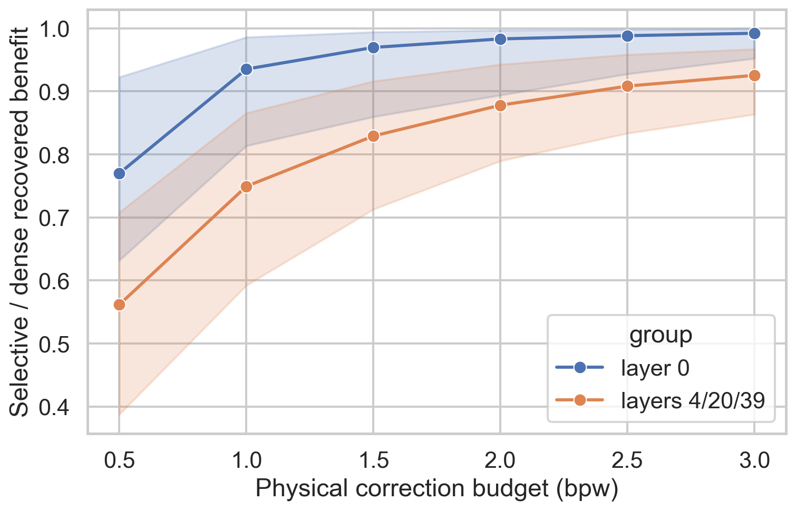
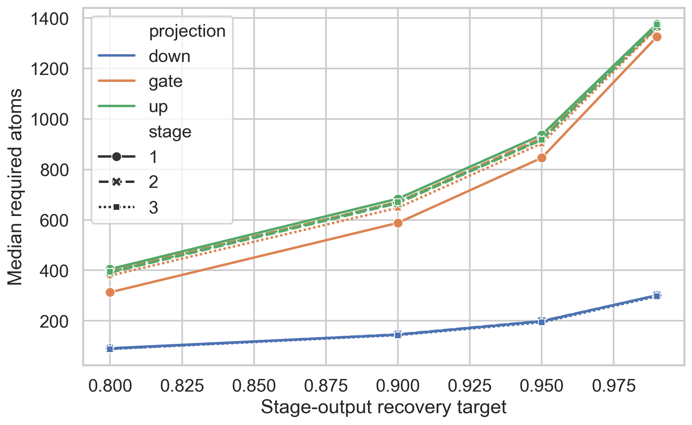
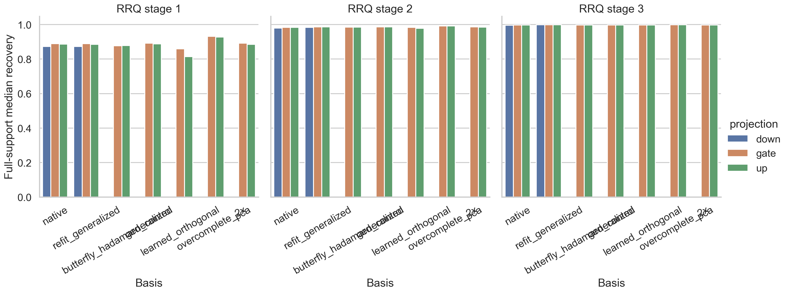
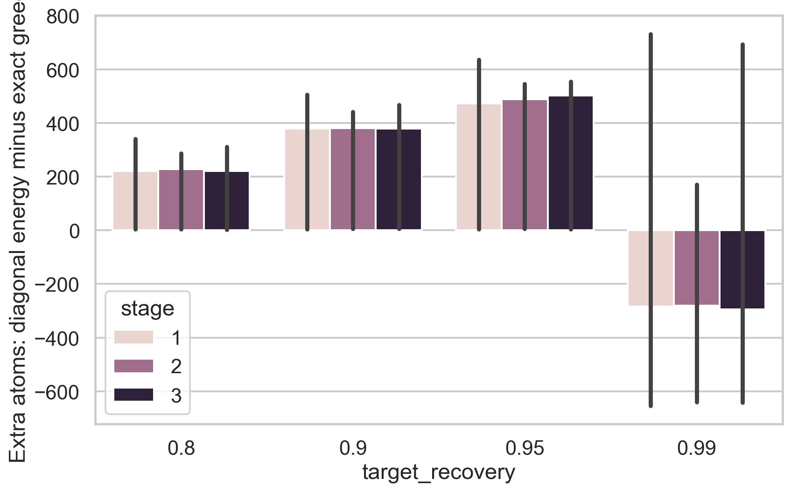
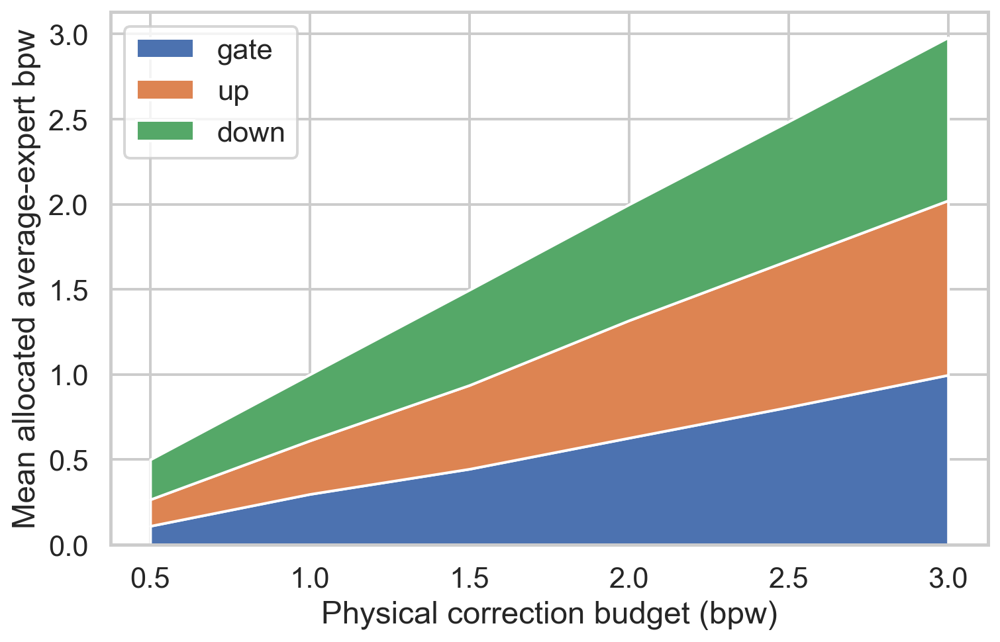

# Selective RRQ Retention Follow-up

## Executive conclusion

Selective atom-major RRQ is **materially better than PR #2 at moderate rates, but it does not satisfy the predeclared broad-scaling gate at 2 physical correction bpw**. Across 159 held-out difficult-layer invocations (layers 4/20/39), the validation-fixed generalized-gate/generalized-up/native-down policy reaches 87.43% median complete-expert proxy recovery at exactly 2.0 physical bpw (p10 78.56%, p90 93.95%; 95% request-cluster CI for the median 86.10–87.98%). Its matched full-support three-stage atom-RRQ comparator reaches 99.62%, so the selective policy retains a median 87.80% of the available RRQ benefit at 2 bpw. It crosses 90% median at 2.5 bpw (90.38%) and reaches 92.24% at 3 bpw.

On the exact 27-invocation difficult-layer subset shared with PR #2, selective RRQ improves recovery by a paired median **6.48 points at 2 bpw** (95% request-cluster CI +5.52 to +9.41), 7.86 points at 2.5 bpw, and 9.37 points at 3 bpw. It is worse by 11.48 points at 0.5 bpw because 512-byte atom pages deliver only 0.219 logical bpw inside that physical budget. Thus recurrent stages remove the codec plateau, while page amplification and broad gate/up support remain the limiting system effects.

The hypothesis is **partially supported**. Selectivity is useful: it retains 90.83% of the matched dense benefit at 2.5 bpw, using about 2.05× less traffic than the sampled production-reference tensors. It is not yet a validated near-reference design: p10 recovery is 82.74% at 2.5 bpw, the difficult-layer 2-bpw median misses 90%, and direct production-reference replay has not passed identity.

This is a paired exploratory follow-up to the dense-prefix ceiling, not a new confirmatory test: the earlier PR #2 and dense results motivated the hypotheses and the same 16 test requests are reused. All transforms and quantizer choices remain training/validation-only. A fresh request set is required before a confirmatory claim.

## Question and retention definition

The primary question is how much of a matched full-support, three-stage atom-major RRQ package can be retained by activation-dependent page selection. The prompt's literal per-invocation ordering is:

\[
\eta(B)=\frac{D(Q2)-D(\text{full-support atom RRQ})}{D(Q2)-D(\text{selective at }B)}.
\]

Because the phrase “retention” usually denotes the reciprocal, the report also saves and plots:

\[
\eta_{retained}(B)=\frac{D(Q2)-D(\text{selective at }B)}{D(Q2)-D(\text{full-support atom RRQ})}.
\]

Both are intentionally unclipped. For positive gains they are reciprocals; reporting both removes any ambiguity from the displayed fraction in the request. Negative values mean that one approximation increases damage relative to Q2.

## Scope and correctness

- Model: Qwen3.6-35B-A3B, 40 routed layers, 256 experts/layer, top-8 routing.
- Expert tensors: gate/up `512×2048`, down `2048×512`; 1,048,576 weights/projection and 3,145,728 weights/expert.
- Layers: 0, 4, 20, 39, with layer 0 kept separate from the difficult aggregate 4/20/39.
- Resident base: exact serialized/dequantized FP16-scale Q2 from the dense run.
- Gate/up basis: training-only generalized transform; down: native coordinates.
- Packet format: atom-major two-bit RRQ; each group is wholly contained in one atom. Codes, FP16 scales, and affine zero points are charged. Atom identity and offset tables are local.
- Physical transfer: independently fetchable packets rounded to 512-byte pages. Gate/up and down packet sizes are reported from the serialized encoding, not nominal bit widths.
- Nested stage constraint: stage `s+1` for an atom is unavailable until stage `s` is selected.
- Sequential expert: gate/up corrections form `h̃=SiLU(g̃)⊙ũ`; selected down matrices are applied to that same `h̃`.
- Allocation: diagonal-energy action queues produce scalable support paths. A separable linearized screen considers every 0.25-bpw gate/up/down split and the best 16 tuples are reevaluated with the exact sequential expert. A smaller exact-marginal greedy constrained to the next item in each queue, plus bounded beam audits, quantify search regret.
- Direct H1–H4 replay remains unavailable because the production mixed-GGUF path cannot yet reproduce the captured BF16 Transformers path identically. No router/logit/token result is inferred.

## Selective-versus-dense retention

Primary difficult-layer result (159 invocations from 15 held-out requests; all values are unclipped):

| Physical budget (bpw) | Recovery p10 | Median | p90 | Median 95% CI | Literal η p10 / median / p90 | Benefit retained p10 / median / p90 | Logical bpw | Page amp. |
| ---: | ---: | ---: | ---: | ---: | ---: | ---: | ---: | ---: |
| 0.5 | 38.60% | 55.81% | 70.60% | 52.53–57.61% | 1.412 / 1.780 / 2.579 | 38.77% / 56.16% / 70.83% | 0.219 | 2.283× |
| 1.0 | 59.03% | 74.60% | 86.37% | 72.46–76.10% | 1.155 / 1.335 / 1.689 | 59.23% / 74.93% / 86.57% | 0.371 | 2.695× |
| 1.5 | 71.05% | 82.57% | 91.40% | 80.93–83.58% | 1.092 / 1.206 / 1.403 | 71.29% / 82.91% / 91.61% | 0.587 | 2.556× |
| 2.0 | 78.56% | 87.43% | 93.95% | 86.10–87.98% | 1.061 / 1.139 / 1.266 | 78.96% / 87.80% / 94.27% | 0.738 | 2.708× |
| 2.5 | 82.74% | 90.38% | 95.60% | 89.39–90.68% | 1.043 / 1.101 / 1.200 | 83.34% / 90.83% / 95.83% | 0.954 | 2.621× |
| 3.0 | 85.77% | 92.24% | 96.43% | 91.43–92.80% | 1.034 / 1.081 / 1.158 | 86.34% / 92.53% / 96.71% | 1.167 | 2.567× |

The prompt's literal η is dense gain divided by selective gain, so smaller values approaching one are better. “Benefit retained” is its more intuitive reciprocal.

Exact paired comparison with PR #2's deployable corrected allocator on 27 difficult-layer invocations from nine request clusters:

| Budget | RRQ median | PR #2 median | Paired median difference | 95% request-bootstrap CI |
| ---: | ---: | ---: | ---: | ---: |
| 0.5 | 55.48% | 73.41% | −11.48 points | [−19.39, −3.79] |
| 1.0 | 74.60% | 77.67% | +0.69 points | [−4.16, +3.32] |
| 1.5 | 84.66% | 78.79% | +3.82 points | [+2.47, +7.95] |
| 2.0 | 88.07% | 81.36% | **+6.48 points** | **[+5.52, +9.41]** |
| 2.5 | 90.68% | 81.95% | +7.86 points | [+6.48, +10.61] |
| 3.0 | 92.54% | 82.49% | +9.37 points | [+7.89, +13.26] |



## Stage-specific support sizes

Median physical-page support crossings on difficult layers are:

| Projection | RRQ stage | k80 | k90 | k95 | k99 | Projection bpw at k90 |
| --- | ---: | ---: | ---: | ---: | ---: | ---: |
| Gate | 1 | 313 / 2048 | 588 | 846 | 1326 | 2.297 |
| Gate | 2 | 397 | 671 | 925 | 1362 | 2.621 |
| Gate | 3 | 379 | 648 | 903 | 1360 | 2.531 |
| Up | 1 | 405 / 2048 | 684 | 937 | 1377 | 2.672 |
| Up | 2 | 391 | 666 | 917 | 1367 | 2.602 |
| Up | 3 | 394 | 671 | 918 | 1375 | 2.621 |
| Down | 1 | 91 / 512 | 145 | 198 | 301 | 1.133 |
| Down | 2 | 89 | 146 | 199 | 301 | 1.141 |
| Down | 3 | 88 | 143 | 194 | 297 | 1.117 |

Later residual stages do **not** become materially sparser: gate k90 is 588/671/648 and up is 684/666/671 across stages 1/2/3. Down is consistently more concentrated in native coordinates. The earlier belief that down must dominate selective traffic no longer holds for this RRQ action space; broad gate/up support and their 512-byte packet granularity are now at least as important.



## Stage-specific basis audit

Full support is evaluated before masking. Families include native, PCA, the old generalized basis, a generalized basis refitted after each decoded RRQ stage, the repository's learned-orthogonal spectral relaxation, a fixed butterfly/Hadamard control, and a two-view PCA/generalized overcomplete diagnostic for gate/up. The butterfly is a control, not a trained butterfly network.

The audit uses 44 difficult-layer held-out invocations from three training-frequency-stratified experts per layer. Values are median full-support projection recovery; a poor value here disqualifies a transform before masking.

| Projection | Basis/view | Stage 1 | Stage 2 | Stage 3 |
| --- | --- | ---: | ---: | ---: |
| Gate | native | 88.85% | 98.37% | 99.67% |
| Gate | PCA | 89.21% | 98.59% | 99.73% |
| Gate | existing generalized | 89.19% | 98.58% | 99.74% |
| Gate | stage-refit generalized | 88.87% | 98.61% | 99.79% |
| Gate | learned orthogonal | 85.89% | 98.29% | 99.72% |
| Gate | butterfly/Hadamard control | 87.71% | 98.46% | 99.71% |
| Gate | two-view overcomplete | **93.13%** | **99.16%** | **99.84%** |
| Up | native | 88.67% | 98.41% | 99.72% |
| Up | PCA | 88.57% | 98.48% | 99.73% |
| Up | existing generalized | 88.73% | 98.56% | 99.74% |
| Up | stage-refit generalized | 88.52% | 98.56% | 99.80% |
| Up | learned orthogonal | 81.39% | 97.78% | 99.66% |
| Up | butterfly/Hadamard control | 87.81% | 98.48% | 99.73% |
| Up | two-view overcomplete | **92.74%** | **99.15%** | **99.85%** |
| Down | native | 87.24% | 97.96% | 99.53% |
| Down | stage-refit generalized | 87.32% | 98.41% | 99.79% |

The existing generalized transform does not impose a systematic difficult-layer full-support penalty versus native (gate +0.34 points and up +0.07 at stage 1), although layer-0 up loses 4.02 points. A two-view PCA/generalized diagnostic adds roughly four stage-1 points for both gate and up, while stage-refitting mainly helps later prefixes. It is the strongest basis diagnostic but was not used in the deployable frontier and needs exact serialized 2×-view accounting in the next run. The “learned orthogonal” spectral relaxation and fixed butterfly control do not help.



## Ranking and allocation regret

Exact projection-residual marginal greedy exposes large cross-term regret at the 90% crossing (four audited invocations, one per layer):

| Projection | Stage | Diagonal-energy atoms | Recomputed-marginal atoms | Extra atoms | Extra projection bpw |
| --- | ---: | ---: | ---: | ---: | ---: |
| Gate | 1 | 639.0 | 277.5 | 398.0 | 1.555 |
| Gate | 2 | 709.0 | 282.0 | 427.0 | 1.668 |
| Gate | 3 | 653.5 | 273.5 | 393.5 | 1.537 |
| Up | 1 | 733.5 | 304.0 | 465.5 | 1.818 |
| Up | 2 | 692.5 | 294.0 | 384.0 | 1.500 |
| Up | 3 | 713.5 | 265.5 | 449.0 | 1.754 |
| Down | 1 | 125.5 | 119.5 | 4.5 | 0.035 |
| Down | 2 | 126.5 | 120.5 | 6.0 | 0.047 |
| Down | 3 | 127.5 | 121.5 | 6.0 | 0.047 |

Thus gate/up appear broad partly because the diagonal score ignores atom cancellation and correlation; down's native atoms are nearly diagonal. At the 99% crossing, recomputed marginal greedy can become worse than the static order because greedy is myopic and the objective is non-submodular. It must not be interpreted as an exact global optimum. Beam widths 16 and 64 are identical through depth 16 inside the same 32-candidate pool; that bounded check validates the local result but does not resolve the high-support optimum.

The nonlinear complete-expert queue greedy is also worse than the scalable 0.25-bpw split search because it considers only the next item from each diagonal-energy queue and can accept later negative-utility actions:

| Budget | Queue-greedy median | Scalable shortlist + exact sequential median | Difference |
| ---: | ---: | ---: | ---: |
| 0.5 | 49.99% | 65.12% | −10.08 points |
| 1.0 | 56.12% | 77.47% | −19.59 points |
| 1.5 | 58.33% | 84.97% | −23.64 points |
| 2.0 | 58.77% | 88.20% | −28.03 points |
| 2.5 | 59.23% | 90.63% | −29.40 points |
| 3.0 | 57.72% | 92.33% | −31.65 points |

These four-case search audits identify interaction-aware gate/up support as the highest-value algorithmic next step. They do not establish a global complete-expert oracle.

The bounded beam comparison searches only the 32 strongest energy candidates for its first 16 selections; it validates local greedy behavior but is not a global high-support optimum. The exact residual greedy recomputes all projection-local atom interactions to each reported crossing. Complete-expert queue greedy recomputes nonlinear damage after every accepted packet but considers the next nested item in each projection's energy queue, not all thousands of atoms simultaneously.



## Complete sequential allocation frontier

The exact sequential expert reevaluates the best 16 linearly screened splits. Mean rates below sum to the actual budget; the modal tuple is shown separately because no single split dominates above 1.5 bpw.

| Total bpw | Mean gate / up / down bpw | Most common tuple | Tuple share | Median recovery |
| ---: | ---: | ---: | ---: | ---: |
| 0.5 | 0.110 / 0.156 / 0.234 | (0, 0.25, 0.25) | 47.2% | 55.81% |
| 1.0 | 0.297 / 0.314 / 0.388 | (0.25, 0.25, 0.50) | 34.6% | 74.60% |
| 1.5 | 0.445 / 0.492 / 0.560 | (0.50, 0.50, 0.50) | 15.1% | 82.57% |
| 2.0 | 0.627 / 0.690 / 0.681 | (0.50, 0.75, 0.75) | 10.7% | 87.43% |
| 2.5 | 0.808 / 0.862 / 0.816 | (0.75, 1.00, 0.75) | 10.1% | 90.38% |
| 3.0 | 0.997 / 1.025 / 0.958 | (1.25, 1.00, 0.75) | 8.8% | 92.24% |

At 2 bpw the mean allocation is nearly balanced, not down-dominated. Down used 86.6% of PR #2 traffic because its nested atom codec was pathological; RRQ repairs that defect and shifts the bottleneck to broad gate/up support. Across difficult-layer selected actions, 89.2% are stage 1, 9.9% stage 2, and 1.0% stage 3 at 2 bpw.



## Storage, compute, and limitations

| Physical bpw | Bytes/expert | Logical bpw | Page amp. | Deployment extra FLOPs (median) | Ratio to one expert GEMV | Reduction vs nominal Q4 | Reduction vs sampled production reference |
| ---: | ---: | ---: | ---: | ---: | ---: | ---: | ---: |
| 0.5 | 196,608 | 0.219 | 2.283× | 1.34 M | 0.212× | 8.00× | 10.23× |
| 1.0 | 393,216 | 0.371 | 2.695× | 2.42 M | 0.384× | 4.00× | 5.11× |
| 1.5 | 589,824 | 0.587 | 2.556× | 3.32 M | 0.528× | 2.67× | 3.41× |
| 2.0 | 786,432 | 0.738 | 2.708× | 4.47 M | 0.711× | 2.00× | 2.56× |
| 2.5 | 983,040 | 0.954 | 2.621× | 5.55 M | 0.882× | 1.60× | 2.05× |
| 3.0 | 1,179,648 | 1.167 | 2.567× | 6.60 M | 1.049× | 1.33× | 1.70× |

The production-reference reduction uses the invocation-weighted 5.115-bpw serialized reference rate for layers 4/20/39; nominal-Q4 reduction is `4/B`. The full three-stage correction package plus production fallback occupies 2.21–2.52× reference storage. The Q2 base is 884,928 local bytes/expert (2.2505 effective resident bpw) and is not duplicated externally. The five-times allowance therefore leaves substantial capacity, but this amended run intentionally did not spend it on layout replicas. The two-view diagnostic was evaluated for fidelity, not serialized as the deployable package.

The primary packet size is 512 bytes. Scale tables are streamed, atom IDs are implicit in local offsets, and the exact page IDs are retained. Page amplification remains 2.57–2.71× at practical rates, so layout/scale-page coalescing is a larger opportunity than another dense RRQ stage. The 512-byte granularity is inherited from PR #2 as the best measured sector size; this follow-up did not re-optimize 1/2/4-KiB selective layouts.

Deployment FLOPs include selected atom accumulation and selected gate/up analysis rows. A future top-8 implementation can reuse the union of analysis rows; this per-expert pilot does not claim that reuse. H0 also evaluates a full 2,048×2,048 transform (8.39 M FLOPs per layer-token) for selection. One FP16 gate/up analysis basis is 8 MiB resident per layer. No fused kernel or DGX Spark timing was measured.

The full transform is H0 selection overhead; a future predictor would evaluate only the union of selected analysis rows. All GPU timings in the ledger are RTX 3090 experiment timings, not DGX Spark timings. GB10 costs remain analytical.

## Recommendation

**Do not launch an exhaustive all-40-layer study yet.** The method passes the material-improvement test (+6.48 paired points at 2 bpw) but misses the stated broader-scaling criterion: difficult-layer median is 87.43% rather than 90% by 2 bpw, and p10 is 78.56%. It reaches 90.38% only at 2.5 bpw, where page-rounded traffic is still 2.05× smaller than the sampled production reference.

Run one more bounded four-layer iteration focused on the two measured bottlenecks:

1. Replace diagonal gate/up ranking with an interaction-aware approximation (OMP/low-rank Gram correction or blockwise marginal recomputation). The four-case oracle audit cuts k90 by about 398 gate and 466 up atoms; this is much larger than down's 4–6-atom regret.
2. Serialize the two-view stage-1 gate/up candidate and learn training-only co-selection pages with shared code/scale pages. Its full-support stage-1 gain is about four points and the 5× cap has room, while current page amplification is 2.71× at the 2-bpw point.
3. Keep native RRQ down and allow a dense first-down-stage fallback only as a validation-selected option; down is no longer the dominant selective byte consumer.
4. Lock that design on validation and use a fresh request set for confirmation. If it does not reach at least 90% median and 80% p10 by 2 physical bpw, move to the proposed activation-conditioned complete-expert residual VQ/local-affine atlas rather than adding more global-basis seeds.
5. Before any near-reference claim, add the production-GGUF injection hook, pass unchanged-output replay identity, then measure H1–H4 router/logit/token behavior.

The five-times storage budget helped establish that fidelity is not capacity-limited, but extra storage alone was not the measured runtime solution. The next iteration should spend it specifically on a stage-1 two-view packet layout, not arbitrary replicas.

## Reproduction

```bash
python scripts/run_selective_rrq_retention.py \
  --config configs/q2_rrq_selective_retention.json \
  --captures work/rrq_captures_seed20260817.npz \
  --dense-result results/qwen36_q2_rrq_dense_ceiling_20260818_v1 \
  --output results/qwen36_q2_rrq_selective_retention_20260818_v1

python scripts/run_selective_rrq_ranking_supplement.py \
  --config configs/q2_rrq_selective_retention.json \
  --captures work/rrq_captures_seed20260817.npz \
  --dense-result results/qwen36_q2_rrq_dense_ceiling_20260818_v1 \
  --output results/qwen36_q2_rrq_selective_retention_20260818_v1/ranking_regret_supplement.parquet \
  --layers 20 39

python scripts/analyze_selective_rrq.py \
  --result results/qwen36_q2_rrq_selective_retention_20260818_v1
```
